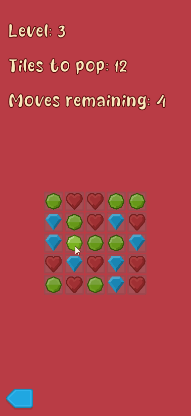

# Tile Match Game

This is a mobile game made in Unity where the objective is to clear as many tiles on the board before you run out of moves. Neighbouring tiles of the same tile cluster together as "islands" and get consumed on one touch.

## Features
- Extendable grid sizes for layouts.
- Popped tiles are removed from the board and random ones are generated in their place.
- Levels driven via Scriptable Objects which determine level size, tiles to pop target, moves remaining and types of tiles involved.
- Tapping a tile with no shared neighbours registers as an invalid move.
- Basic flow for level selection and a win/lose screen.
- Event driven architecture.

## Run Info
- Unity 2020.3.30 LTS
- Tested on Android

## Resources
- Kenney's Free Art Packs
- Sweets Smile Free Font